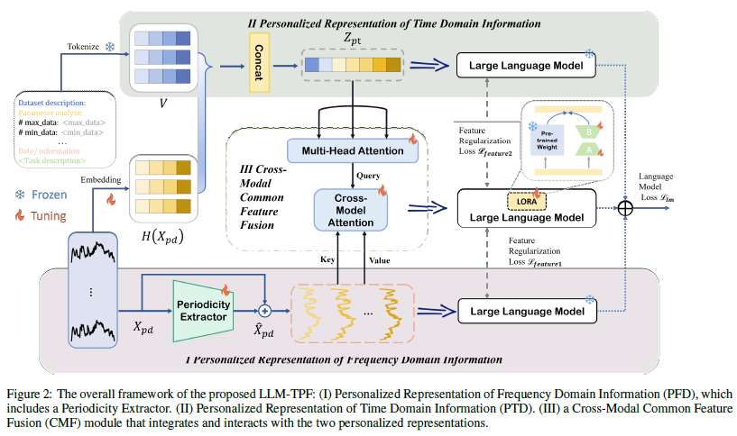
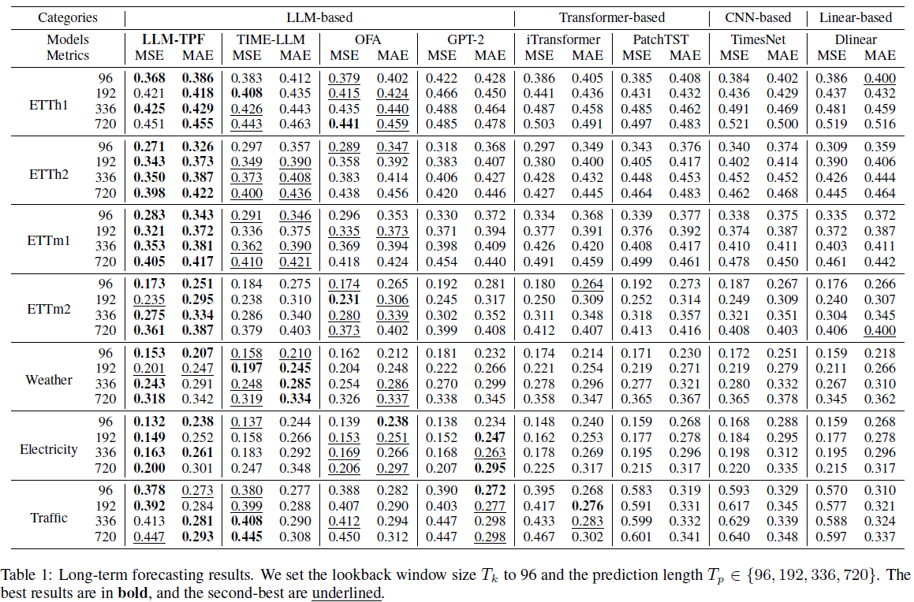
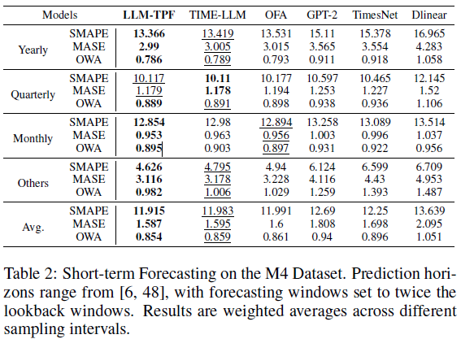
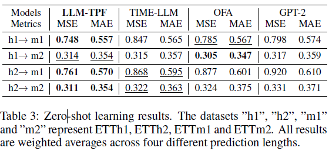

<div align="center">
  <h2><b>LLM-TPF: Multiscale Temporal Periodicity-Semantic Fusion LLMs for Time Series Forecasting</b></h2>
</div>

<div align="center">
</div>

<div align="center">

Qihong Pan<sup>1,2</sup>,
<a href="https://scholar.google.com/citations?user=A-thhLMAAAAJ&hl=zh-CN&oi=ao">Haofei Tan</a><sup>1,2</sup>,
<a href="https://homepage.zjut.edu.cn/sgj/">Guojiang Shen</a><sup>1,2</sup>,
<a href="https://scholar.google.com/citations?user=Z0dStKsAAAAJ&hl=zh-CN&oi=ao">Xiangjie Kong</a><sup>1,2,*</sup>,
<a href="https://scholar.google.com/citations?user=VSRnUiUAAAAJ&hl=zh-CN">Mengmeng Wang</a><sup>1,2</sup>,
Chenyang Xu<sup>1,2</sup>

<sup>1</sup> College of Computer Science and Technology, Zhejiang University of Technology, Zhejiang, China <sup>2</sup> Zhejiang Key Laboratory of Visual Information Intelligent Processing, Zhejiang, China

<sup>*</sup> Corresponding author

**Proceedings of the Thirty-Fourth International Joint Conference on Artificial Intelligence (IJCAI 2025)**

**[Paper](https://www.ijcai.org/proceedings/2025/671)** · **[Code](https://github.com/switchsky/LLM-TPF)**

</div>

---


## Overview

LLM-TPF is a large-language-model-based framework for time series forecasting.
It aims to enhance LLMs with **multiscale temporal periodicity** and **semantic temporal understanding**.

Different from directly decomposing time series or simply prompting LLMs, LLM-TPF introduces:

* **PFD**: Personalized Frequency Domain Representation
* **PTD**: Personalized Time Domain Representation
* **CMF**: Cross-Modal Common Feature Fusion

<div align="center">
  
  <br>
  <em>Overall framework of LLM-TPF.</em>
</div>

The model extracts periodic patterns from the frequency domain, introduces semantic prompts in the time domain, and fuses heterogeneous temporal information through cross-modal attention.

---

## Environmental setup

Create the environment:

```bash
conda create -n llm-tpf python=3.10
conda activate llm-tpf
```

Install dependencies:

```bash
pip install -r requirements.txt
```

The main dependencies may include:

```text
pytorch
einops==0.4.1
matplotlib==3.8.3
numpy==1.22.4
pandas==1.4.2
patool==1.15.0
peft==0.9.0
scikit_learn==1.0.2
torch==2.3.1
tqdm==4.66.4
transformers==4.30.1
```

More details will be provided after the official code release.

---

## Code description

The main structure of this repository is expected to be:

```text
LLM-TPF/
├── assets/              # Figures and images used in README
├── data_provider/       # Dataset loading and preprocessing
├── exp/                 # Experiment pipeline and task settings
├── layers/              # Core layers of LLM-TPF
├── models/              # Model definitions
├── prompt_bank/         # Prompt templates and textual descriptions
├── scripts/             # Shell scripts for running experiments
├── utils/               # Utility functions
├── cal.py               # Calculation or evaluation helper script
├── pca.py               # PCA-based text prototype processing
├── run.py               # Main entrance for training and evaluation
├── requirements.txt     # Python dependencies
├── LICENSE
└── README.md
```

### Main modules

| Module | Description                                                                                |
| ------ | ------------------------------------------------------------------------------------------ |
| `PFD`  | Extracts periodic features from the frequency domain with FFT and periodic reconstruction. |
| `PTD`  | Builds prompt-enhanced time-domain representations.                                        |
| `CMF`  | Fuses frequency-domain and time-domain information through cross-modal attention.          |
| `LoRA` | Performs lightweight LLM fine-tuning.                                                      |


## Experimental Results

We report several representative results from long-term forecasting, short-term forecasting, and zero-shot forecasting.
Lower values indicate better performance.

## Experimental Results

We report representative results from long-term forecasting, short-term forecasting, and zero-shot forecasting.  
For complete results, please refer to our paper.

<div align="center">

<h3>Long-term Forecasting</h3>

<p>Representative results on ETTh2 and Electricity across prediction lengths of <code>96</code>, <code>192</code>, <code>336</code>, and <code>720</code>.</p>


<br>
<em>Long-term forecasting results on ETTh2 and Electricity.</em>

</div>

<table align="center">
  <tr>
    <td align="center" width="50%">
      <h3>Short-term Forecasting</h3>
      <p>Average results on the M4 dataset.</p>
      
      <br>
      <em>Short-term forecasting results on M4.</em>
    </td>
    <td align="center" width="50%">
      <h3>Zero-shot Forecasting</h3>
      <p>Representative zero-shot results across ETT datasets.</p>
      
      <br>
      <em>Zero-shot forecasting results on ETT datasets.</em>
    </td>
  </tr>
</table>

### Example usage

Long-term forecasting:

```bash
bash scripts/long_term_forecast/ETTh1.sh
```

Or run directly:

```bash
python run.py \
  --root_path ./datasets/ETT-small/ \
  --data_path ETTh1.csv \
  --task_name long_term_forecast \
  --model_id ETTh1_TPF_96_96 \
  --model TPF \
  --data ETTh1 \
  --seq_len 96 \
  --label_len 0 \
  --pred_len 96
```

Zero-shot forecasting:

```bash
bash scripts/zero_shot/ETTh1_to_ETTm.sh
```

---

## Acknowledgement

We appreciate the following github repos a lot for their valuable code base:

https://github.com/thuml/Time-Series-Library

https://github.com/KimMeen/Time-LLM

https://github.com/Hank0626/CALF

https://github.com/DAMO-DI-ML/NeurIPS2023-One-Fits-All

---

## Citation

If you find this repo useful, please cite our paper via

```bibtex
@inproceedings{tan2025tpf,
  title={LLM-TPF: Multiscale Temporal Periodicity-Semantic Fusion LLMs for Time Series Forecasting},
  author={Pan, Qihong and Tan, Haofei and Shen, Guojiang and Kong, Xiangjie and Wang, Mengmeng and Xu, Chenyang},
  booktitle={IJCAI},
  year={2025}
}
```

---

## Contact Us

For inquiries or further assistance, contact us at [haofei_tan@outlook.com](mailto:haofei_tan@outlook.com) or open an issue on this repository.
